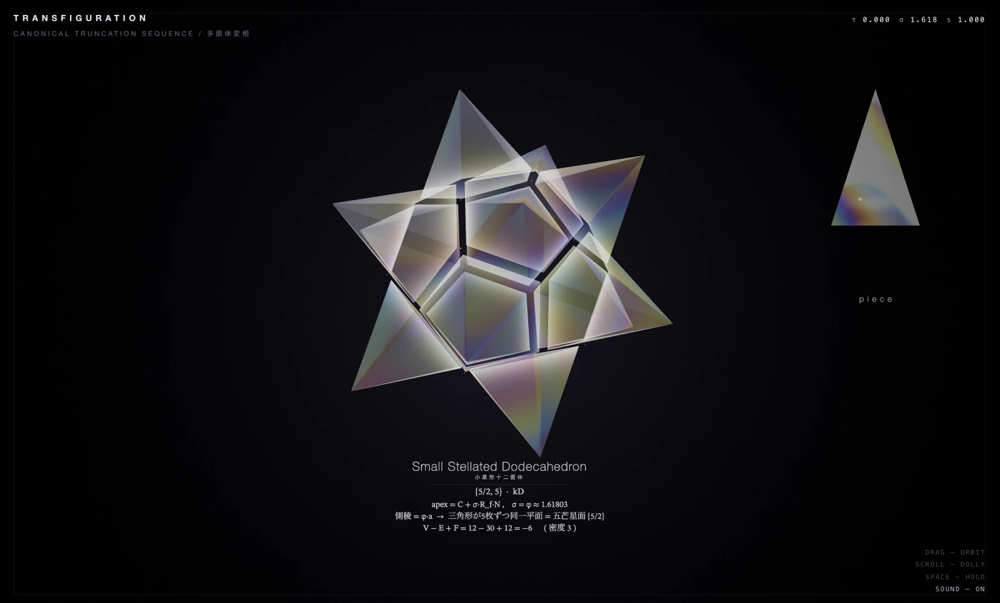
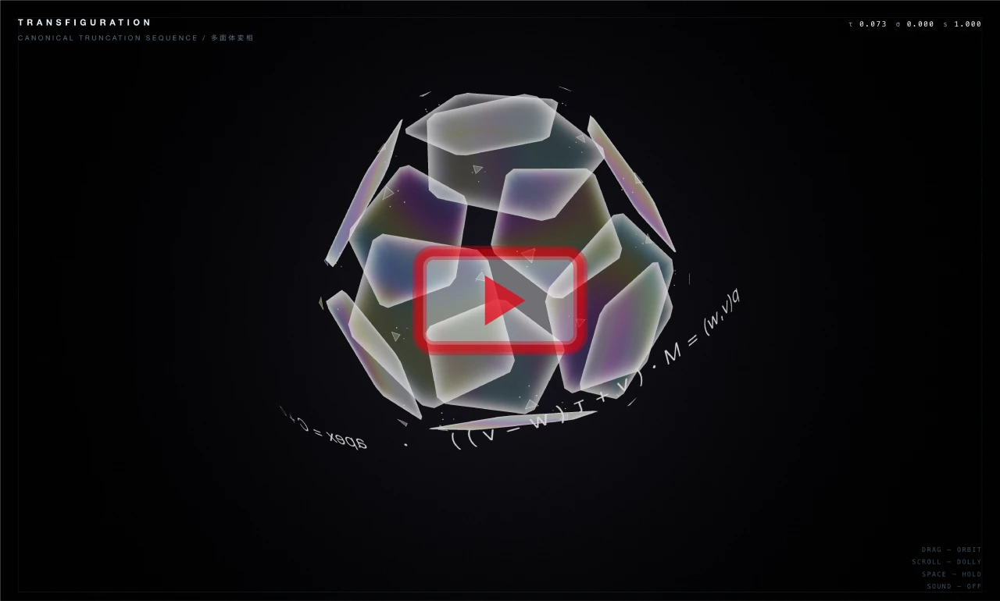

# TRANSFIGURATION

**Canonical Truncation Sequence / 多面体変相**

多面体の数式を眺めていたら、  
形が変わるなら、音も変わるのではないかと思いました。

頂点、辺、面から生まれる幾何学的な長さを、  
そのまま耳に聞こえる周波数へ写像しています。

音楽を付けたのではなく、  
形を少しだけ「聴けるもの」にしています。

> *What would a polyhedron sound like if its geometry were allowed to speak for itself?*

[▶ Watch Demo](https://youtu.be/NzO2nee3agU) | [◇ Try it live](https://wory-bonbon.github.io/transfiguration/)

低い音がよく聞こえるので、イヤホンかヘッドフォンをおすすめします。

*Best heard with earphones or headphones — much of it lives in the low end.*

## Geometry Sonification

辺や面の長さを測り、その幾何学的な比率を周波数へ変換しています。

長い部分は低く。  
短い部分は高く。

単純な形ほど辺が長く、音は低くなります。  
正二十面体は 110Hz の低いうなり。  
切頂が進むほど辺は短くなり、音は高く砕けていきます。

倍音も同じ規則から生まれます。  
その瞬間の多面体が持つ長さの比を、そのまま部分音の比率にしています。

音階やコードへ整えることはせず、  
多面体が持つ数値をなるべくそのまま音として残しています。

> *The simpler the form, the longer its edges — and the lower it sounds.*  
> *The icosahedron hums low at 110 Hz.*  
> *As truncation advances the edges shorten, and the sound climbs and breaks apart.*

## Controls

- **Drag** — Orbit
- **Scroll** — Dolly
- **Space** — Hold
- **Sound** — On / Off

## Technical Note

Built with `Three.js` and `Web Audio API`.

The geometry is generated and transformed in real time.  
The sound is generated from the geometry itself — no soundtrack or audio samples.

Both the fundamentals and their partials come from the same measured lengths.  
Nothing is quantized to a musical scale.

The earlier sound, without partials, is kept at the tag `raw-v1`  
and can be heard live with [`?timbre=raw`](https://wory-bonbon.github.io/transfiguration/?timbre=raw).

## License

Source code is licensed under the [MIT License](./LICENSE).

Artwork and visual assets in [`assets/`](./assets/) are © 2026 Wory Bonbon. All rights reserved.
